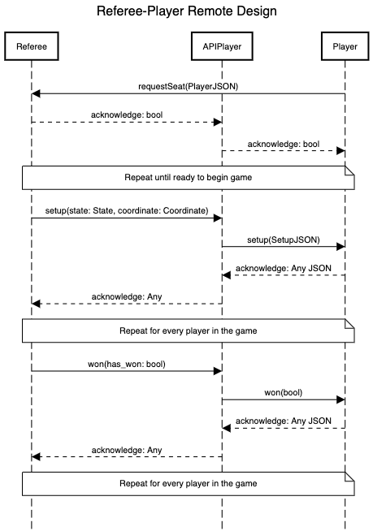

TO: CS4500

FROM: Diana Rodriguez and Thomas Mactaggart

DATE: 11/3/2022

SUBJECT: Remote Design

We believe the protocol for gathering players, launching a game, and reporting the result should be as follows, 
represented by the following sequence diagram:

Note: for the following diagram, all information passed to and from the Player will be as a JSON, specified where 
necessary.



###Gathering Players:
The Referee will act as the server, exposing a port to receive game requests on from Players. The Players will send a
request to the server with their JSON serialized information. The format of this information should be as follows:

PlayerJSON:
```json
{
"name": str,
"age": int,
"color": str
}
```
The Referee will acknowledge the request with a boolean representing if the Player has been given a seat (True), or has
been placed on the wait-list (False). This response will go via the APIPlayer.

###Launching a Game:
The Referee will tell each APIPlayer to setup according to the given State and Coordinate, which represents their
respective goal position. The APIPlayer will in turn send this information to the Player in the following format:

SetupJSON:
```json
{
"state": StateJSON,
"coordinate": Coordinate
}
```

Coordinate:
```json
{
"row#": Index,
"column#": Index
}
```


StateJSON:
```json
{
"board": BoardJSON,
"previousMoves": List[SlideJSON]
}
```

where a SlideJSON is either null or an array of two values, [Index, Direction], where index is an int representing a row
or column on a Board and Direction is one of LEFT, RIGHT, UP, DOWN.

BoardJSON:
```json
{
"connectors": Matrix[Connector],
"spareTile": Tile
"treasures": Matrix[Treasure]
}
```

where Connector is one of: "│, ─, ┐, └, ┌, ┘, ┬, ├, ┴, ┤, ┼" and Treasures is an array of two Gems, as defined in the 
spec, and Tile is as follows:

Tile:
```json
{
"tilekey": Connector,
"1-image": Gem,
"2-image": Gem
}
```

###Reporting the Results:
Once the game is over, the Referee will inform each APIPlayer whether or not their Player has won the game. The APIPlayer
will then report this to the Player. The Player will send back an acknowledgement which the APIPlayer will then forward to the
Referee.


Thank you,

Diana and Thomas
