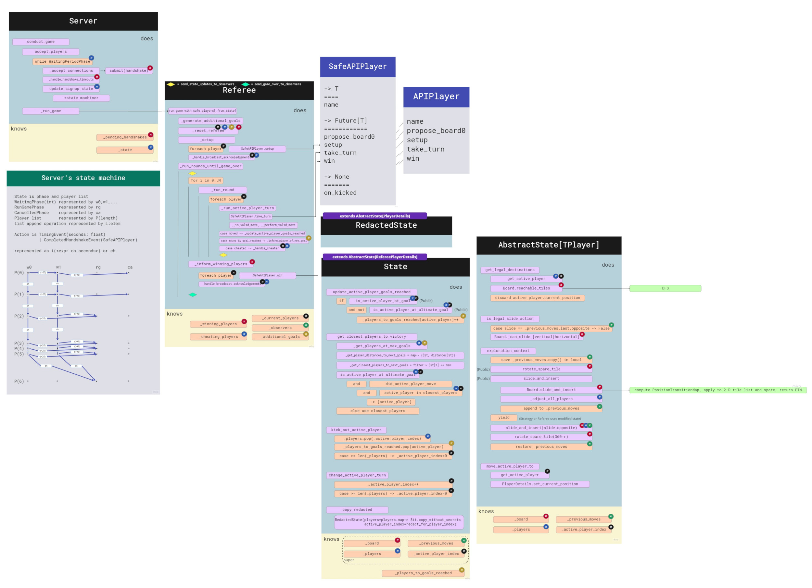
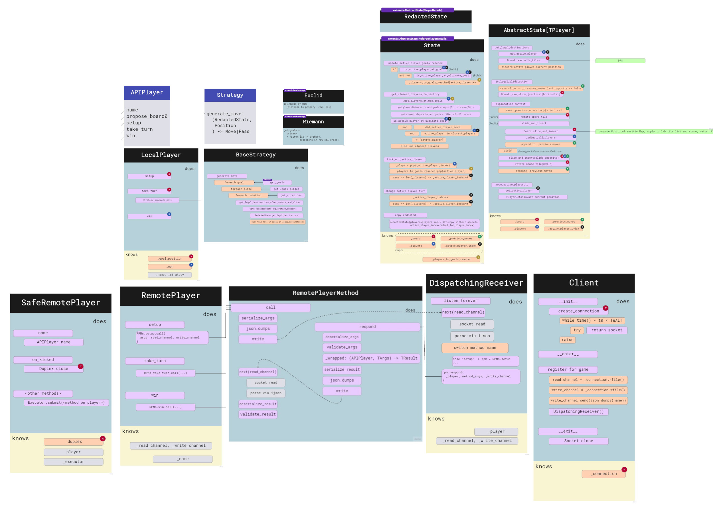

# Development and Testing

To run all unit tests for this Milestone run `./xtest`

To run an individual unit test file run `pytest path/to/file`

To run an individual unit test run `pytest path/to/file::test_function_name`

Before running unit tests you may need to run `make` to install project dependencies

When installing packages, ensure that the version is compatible with Python 3.6. The `requirements.txt`
in this directory contains the latest versions of `pytest` and its dependencies which supported Python 3.6.


# Components and Roadmap

### Common, Player, and Referee (weeks 1-5)

```ascii
+----------------------------+
| Board                      | 
| + width, height            |
| + tiles, spare             |
| + rotate_spare()           |                        +-------dataclass-------+
| + slide_and_insert()       |--------[returns]-----> | PositionTransitionMap |
| + reachable_tiles(), a DFS |                        +-----------------------+    
+----------------------------+

+----------------------------+
| AbstractState              |                                          | |         |
| + board: Board             |                                          | |         |
| + players: PlayerDetails[] |                                          | |         |
| + rotate_spare()           |                                          | |         |
| + slide_and_insert()       | <-----[depends on PositionTransitionMap]-+ |         |
| + get_legal_destinations() | <-----[depends on Board reachable_tiles]---+         |
| + is_legal_slide()         | <-----[depends on Board (height, width, can_slide*)]-+
+----------------------------+

                               +---------interface----------------------+
                               | Strategy                               |
                               | generate_move(): State,Posn->Move|Pass |
                               +----------------------------------------+

+----abstract impl Strategy------+
| BaseStrategy                   |                                                      |    |
| + get_goals() -> Iter[Posn]    |                                                      |    |
|      (abstract)                |                                                      |    |
|                                |                                                      |    |
| + get_legal_slides()           | <-----[depends on AbstractState is_legal_slide]------+    |
| + get_rotations()              |                                                           |
| + generate_move()              | <-----[checks vs. AbstractState get_legal_destinations]---+
|      (depends on preference    |                                                       
|       orders given by above)   |                                                       
+--------------------------------+

                                                                                 
+------extends AbstractState---------+                                           
| State                              |                                           
| + change_active_player_turn()      |                    \_                     
| + kick_active_player()             |                      \_                                                         
| + is_active_player_at_ultimate     |                        \_                                                   
|      _goal()                       |                    [delegates]                                              
| + update_active_player_goals       |                            \_             +---------impl APIPlayer---------+
|      _reached()                    |                              \_           | LocalPlayer                    |
+------------------------------------+                                └--------  | + take_turn()                  |
    /\                                                                           | + ...                          |
    ||                                                                           +--------------------------------+
  [depends on State for move execution via AbstractState ]
  [...............  for in-game logic via top two        ]                        +--------interface----------+
  [...............  for end-game detection via bottom two]                        | APIPlayer (spec'd for us) |
    ||                                                                            +---------------------------+
+------------------------------------+                                                    |||
| Referee                            |                                                    |||
| + state                            |                                                    |||
| + run_game*()                      |                                                    |||
|      (differing signatures,        |                                                    |||
|       APIPlayers are required;     |                                                    |||
|       args left out will be gen.d  |                                                    |||
|       (initial_state, addtl_goals))|                                                    |||
| + setup()                          |----[calls multiple APIPlayers, gathers responses]--+||
| + run_round()                      |                                                     ||
| + _run_active_player_turn()        |----[calls one APIPlayer, awaits response]-----------+|
| + inform_winning_players()         |----[calls multiple APIPlayers, gathers responses]----+
+------------------------------------+
```

### Remote: Server and Client

```ascii
+---------------------------+                                          +-------------------------------+
| Server                    |                                          | Client                        |
| ========================= |                                          | ============================= |
|  job¹ is to accept² TCP   |                                          |  job is to open¹ a TCP        |
|  connections and in BG,   |                                          |  connection, retrying         |
|  handshake, producing a   |                                          |  indefinitely; then² to       |
|  SafeAPIPlayer if         |                                          |  send a name as a             |
|  successful.              |                                          |  JSON string and create       |
|                           |                                          |  a DispatchingReceiver        |
|  in FG, accum.³ them and  |                                          |  backed by a given APIPlayer  |
|  start⁴ at the correct    |                                          | ============================= |
|  time, or cancel after 2  |                                          | + ¹__init__()                 |
|  waiting periods.         |     [Control given to xclients  <--------| + ²register_for_game()        |
| ========================= |      which then calls                    +-------------------------------+
| + given run_game_fn       |      listen_forever() on the
| + ¹conduct_game()         |      DispatchingReceiver]
| + ²accept_players()       |    
| + ³update_signup_state()  |    
| + ⁴run_game()             |------->[Control handed to a Referee]
+---------------------------+
```

### Remote: Method Calls

The `RemotePlayer` proxies a real player with the help of `RemotePlayerMethod` and its `call` entrypoint, which
composes the functions listed down the left edge of that component. The `DispatchingReceiver` allows its `LocalPlayer` to
be proxied with the help of the `RemotePlayerMethod.respond` entrypoint, which composes the functions listed
down the right edge.

```ascii
    Referee               SafeRemotePlayer       RemotePlayer          ============RemotePlayerMethod===========      DispatchingReceiver   LocalPlayer
    |                     |                      |                     [call]                          [respond]                        |             |
    |  ->                 |                      |                     |                                       |                        |             |
    |  python             |  ->                  |  ->                 |crossing->                   ->crossing|    loops               |             |
    |  call               |  submit to executor  |  select one of      |this                               this|    using               |             |
    |                     |  <-                  |  the remote         |fence                             fence|    read, then          |             |
    |                     |  Future[TResult]     |  methods            |does                               does|    RemotePlayerMethods |             |
    |                     |                      |                     |`serialize_args`        `validate_args`|    .respond(Player)    |             |
    |                     |                      |                     |`write`              `deserialize_args`|                        |             |
    |                     |                      |                     |                                       |                        |             |
    |                     |                      |                     |                                       |                        |             |
    |                     |                      |                     |crossing<-                   <-crossing|                        |             |
    |                     |  <-                  |  <-                 |this                               this|                        |             |
    |  <-                 |  (submit finishes,   |  JSONError          |fence                             fence|                        |             |
    |  await_protected    |   waiters on the     |  | ValidationError  |does                               does|                        |             |
    |  turns Future[T]    |   Future are         |  | TResult          |`validate_result`    `serialize_result`|                        |             |
    |  to Maybe[T]        |   notified)          |                     |`deserialize_result`            `write`|                        |             |
    |  OR                 |                      |                     |                                       |                        |             |
    |  gather_protected   |                      |                     |                                       |                        |             |
    |  turns List[Fut[T]] |                      |                     |                                       |                        |             |
    |  to List[Mby[T]]    |                      |                     |                                       |                        |             |
```

The `RemotePlayerMethod` deals with all of the conversion into and out of our classes
(`Position`, `State`, `Move`, `Pass`, etc.). Functions called `serialize_*` above don't fully
convert to bytes but instead give back some kind of `Jsonable`, which we have many of in our `JSON/definitions.py` file.
The same is true for inputs to `deserialize_*`.

We are protected from malformed JSON by an `ijson.items` object, which will never give us
a non-`Jsonable`, but instead throw `IncompleteJSONError`. We are protected from invalid JSON by
`pydantic`, which will confirm that the shape of the `Jsonable` matches our JSON type definition, or else throw
a `ValidationError`.

These errors are then caught by `gather_` or `await_protected`, and the Referee can check
the `Maybe[TResult]` `is_present` to differentiate success from failure (timeout is also a failure).

# Component Interactions

### Server-side



### Client-side and remote proxies


