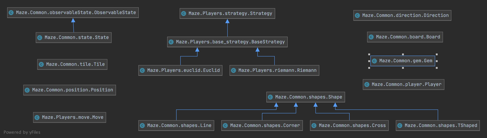

# Files:

## Common
Folder contains our implementation code in the following files:

### __init__.py
Python required file which labels the directory as a Python package, to help with relative imports

### board.py
Contains the source code for our Board model

### boardSerializer.py
Contains methods for creating a Board from JSON values and logic for the xboard testing harness

### direction.py
Contains the source code for our Direction Enum

### gem.py
Contains the source code for our Gem model

### observableState.py
Contains the source code for our Observable State model

### player.py
Contains the source code for our Player model

### playerSerializer.py
Contains methods for creating a Player from JSON values

### position.py
Contains the source code for our Position model

### shapes.py
Contains the source code for our Abstract class shape and the
four concrete classes that implement it: Corner, Line, TShaped, and Cross

### state.py
Contains the source code for our State model

### stateSerializer.py
Contains methods for creating a State from JSON values and logic for the xstate testing harness

### test_board.py
Contains unit tests for the Board model

### test_gem.py
Contains unit tests for the Gem model

### test_shapes.py
Contains unit tests for the Shape model and its implementations

### test_state.py
Contains unit tests for the State model

### test_tile.py
Contains unit tests for the Tile model

### test_utils.py
Contains unit tests for the utility functions

### tile.py
Contains the source code for our Tile model

### utils.py 
Contains code for utility functions that do not belong in a model or may be
used across multiple models

## Planning
Folder containing markdown files for our design tasks

### player.md
Contains our plan for the "player"

### player-protocol.md
Contains our plan for the interaction protocol between the referee and players

### questions-about-the-game.md
Contains our questions about the game for planning task in Milestone 1

### sprints.md
Contains our plan for the first three sprints from Milestone 1

### state.md
Contains our plan for the next sprint, "game state", from Milestone 2

## Players
Folder contains our implementation code in the following files:

### __init__.py
Python required file which labels the directory as a Python package, to help with relative imports

### base_strategy.py
Contains the source code for our Base Strategy model

### basicBoard.json
Contains an example of a board to be used for testing purposes

### basicBoardTwo.json
Contains an example of a board to be used for testing purposes

### euclid.py
Contains the source code for our Euclid strategy model

### move.py
Contains the source code for our Move model

### riemann.py
Contains the source code for our Riemann strategy model

### strategy.py
Contains the source code for our Strategy model

### test_euclid.py
Contains unit tests for our Euclid strategy model

### test_riemann.py
Contains unit tests for our Riemann strategy model

## Resources
Folder containing resources such as images

### __init.py___
Python required file which labels the directory as a Python package, to help with relative imports

### gems
Folder containing all images of gems

#### gemCollections
Folder containing images of pages of gems (not valid gems but provided in the tar file)

#### gem-name.png
Many files containing images of valid gems

## Makefile
File used to install necessary python libraries to run our code

## Readme.md
This file

## requirements.txt
File containing listing of all project dependencies

## xtest
Shell script used to run all unit tests

# Roadmap:
A `Board` has a 2D List of `Tiles`. The grid is 0-indexed, row majored, and board[0][0] represents the Tile at the 
top-left spot on this Board. A Board also has a next `Tile`.

It has the following public class methods:

- from_list_of_tiles(tile_grid, optional seed)
- from_random_board(dimensions, optional seed)

It has the following public methods:

- slide_and_insert(index, Direction)
- reachable_tiles(base_tile)
- get_position_by_tile(Tile)
- get_tile_by_position(Position)
- check_stationary_position(row, col)
- get_all_stationary_tiles()
- get_tile_grid()
- get_next_tile()

A `Tile` has a `Shape` and two `Gems`

It has the following public methods:

- get_gems()
- same_gems_on_tiles(gem1, gem2)
- has_path(direction)
- rotate(rotations)

A `Shape` is one of `Corner`, `Line`, `TShaped`, or `Cross`

Its implementations have the following public methods:

- rotate(rotations)
- has_path(direction)

A `Gem` has a name and an image_path

A `Player` has a three `Position`, current, home, and goal, a `Strategy` and a color.

It has the following public class method:

- from_current_home_color(current_position, home_position, color)

It has the following public methods:

- get_current_position()
- set_current_position(position)
- get_goal_position()
- get_home_position()
- get_next_move(current_state)
- get_color()

A `Position` has a row and a column.

It has the following public methods:
- get_row()
- get_col()

A `Strategy` is one of `Base Strategy` which is one of `Riemann` or `Euclid`

Its implementations have the following public method:

- generate_move(current_state, current_position, target_position)

A `Base Strategy` is one of `Riemann` or `Euclid`

Its implementations have the following public methods:

- get_next_target_position(board)
- possible_next_target_positions(board)
- get_checked_positions()

An `Observable State` has a `Board`

It has the following public method:

- get_board()

A`State` extends `Observable State` and has a `Board` , a List of previous moves, a List of `Players` and an active 
player index

It has the following public class methods:

- from_random_state(board)
- from_current_state(board, players, previous_move)

It has the following public methods:

- rotate_spare_tile(degrees)
- add_player()
- kick_out_active_player()
- is_active_player_at_goal()
- slide_and_insert(index, Direction)
- get_players()
- can_active_player_reach_given_tile(target_tile)
- get_active_player_index()
- is_active_player_at_home()
- change_active_player_turn()
- move_active_player_to(position)

Here is a class diagram for our project:

# Testing:

To run all unit tests for this Milestone run `./xtest`

To run an individual unit test file run `pytest path/to/file`

To run an individual unit test run `pytest path/to/file::test_function_name`

Before running unit tests you may need to run `make` to install project dependencies 

