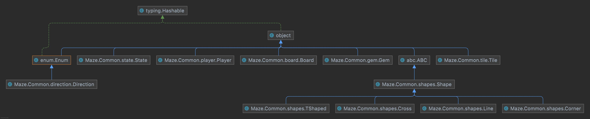

# Files:

## Common
Folder contains our implementation code in the following files:

### board.py
Contains the source code for our Board model

### test_board.py
Contains unit tests for the Board model

### tile.py
Contains the source code for our Tile model

### test_tile.py
Contains unit tests for the Tile model

### shapes.py
Contains the source code for our Abstract class shape and the
four concrete classes that implement it: Corner, Line, TShaped, and Cross

### test_shapes.py
Contains unit tests for the Shape model and its implementations

### gem.py
Contains the source code for our Gem model

### test_gem.py
Contains unit tests for the Gem model

### utils.py 
Contains code for utility functions that do not belong in a model or may be
used across multiple models

### test_utils.py
Contains unit tests for the utility functions

### state.py
Contains the source code for our State model

### test_state.py
Contains unit tests for the State model

## Planning
Folder containing markdown files for our design tasks

### questions-about-the-game.md
Contains our questions about the game for planning task in Milestone 1

### sprints.md
Contains our plan for the first three sprints from Milestone 1

### state.md
Contains our plan for the next sprint, "game state", from Milestone 2

## Resources
Folder containing resources such as images

### gems
Folder containing all images of gems

#### gemCollections
Folder containing images of pages of gems (not valid gems but provided in the tar file)

#### gem-name.png
Many files containing images of valid gems

## Makefile
File used to install necessary python libraries to run our code

## Readme.md
This file

## requirements.txt
File containing listing of all project dependencies

## xtest
Shell script used to run all unit tests

# Roadmap:
A `Board` has a 2D List of `Tiles`. The grid is 0-indexed, row majored, and board[0][0] represents the Tile at the 
top-left spot on this Board. A Board also has a next `Tile`.

It has the following public methods:

- insert_tile()
- slide(index, direction)
- reachable_tiles(base_tile)
- get_tile_grid()
- get_next_tile()
- check_stationary_position(row, col)
- get_all_stationary_tiles()

A `Tile` has a `Shape` and two `Gems`

It has the following public methods:

- get_gems()
- same_gems_on_tiles(gem1, gem2)
- has_path(direction)
- rotate(rotations)

A `Shape` is one of `Corner`, `Line`, `TShaped`, or `Cross`

Its implementations have the following public methods:

- rotate(rotations)
- has_path(direction)

A `Gem` has a name and an image_path

A `Player` has a three `Tiles`, current, home, and goal

It has the following public methods:

- get_current_tile()
- set_current_tile(new_tile)
- get_goal_tile()
- get_home_tile()

A `State` has a `Board` a List of `Players` and an active player index

It has the following public methods:

- rotate_spare_tile(degrees)
- get_board()
- add_player()
- kick_out_active_player()
- is_active_player_at_goal()
- can_active_player_reach_given_tile(target_tile)
- slide(index, direction)
- get_players()

Here is a class diagram for our project:

# Testing:

To run all unit tests for this Milestone run `./xtest`

To run an individual unit test file run `pytest path/to/file`

To run an individual unit test run `pytest path/to/file::test_function_name`

Before running unit tests you may need to run `make` to install project dependencies 

